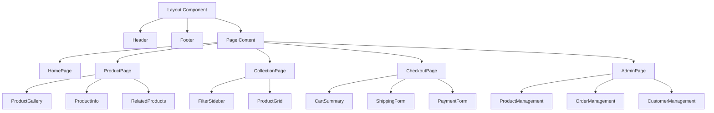
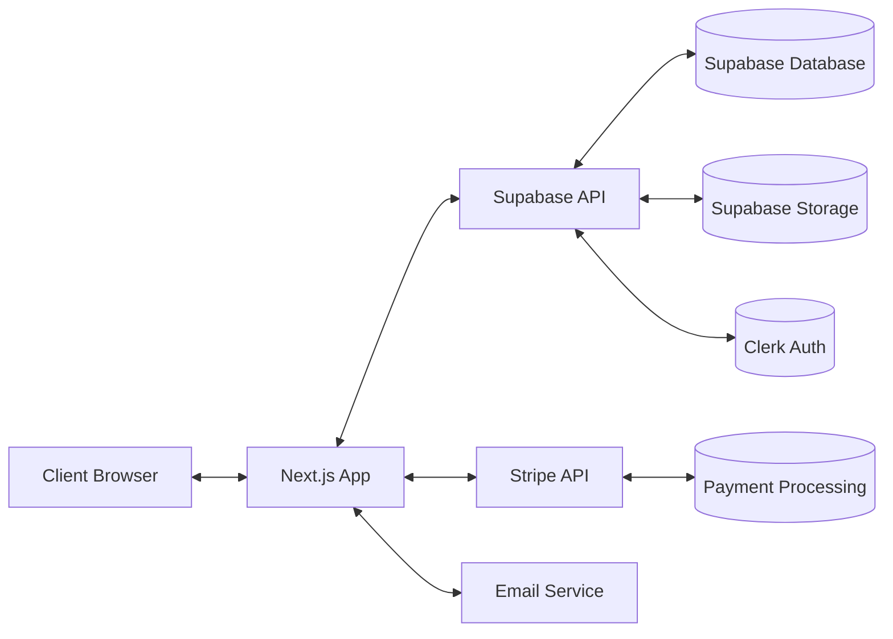

# System Patterns: Exousia

## System Architecture

### Frontend Architecture
The Exousia platform uses a modern frontend architecture based on Next.js 14, leveraging its App Router for enhanced performance and developer experience:

1. **Page Structure**
   - App Router with nested layouts
   - Server Components for improved performance
   - Client Components for interactive elements
   - Dynamic routing for product pages and collections

2. **Component Hierarchy**
   - Shared layouts for consistent header/footer
   - Page-specific components
   - Reusable UI components (buttons, cards, etc.)
   - Animation components for visual effects

3. **State Management**
   - Zustand for global state (cart, user preferences)
   - React Context for theme and authentication state
   - Local component state for UI interactions

### Backend Architecture
The backend leverages Supabase for database, authentication, and storage needs:

1. **Database Structure**
   - Products table with relations to collections, scriptures
   - Orders table linked to users and products
   - Users table with profile information
   - Collections table for product categorization
   - Scriptures table for verse references

2. **API Layer**
   - Supabase REST API for data operations
   - Supabase Functions for complex operations
   - Stripe API for payment processing
   - Nodemailer for email communications

3. **Authentication Flow**
   - Clerk Auth for user authentication
   - Role-based access control for admin functions
   - Secure session management

## Key Technical Decisions

1. **Next.js + Supabase Stack**
   - Provides optimal balance of performance, developer experience, and scalability
   - Enables both static generation and server-side rendering where appropriate
   - Simplifies backend development with Supabase's comprehensive features

2. **Tailwind + Shadcn/UI**
   - Enables rapid UI development while maintaining design consistency
   - Provides accessible components that can be customized for the unique brand aesthetic
   - Reduces CSS complexity while allowing for sophisticated designs

3. **Framer Motion for Animations**
   - Creates smooth, performant animations for enhanced user experience
   - Enables complex scroll-based animations and transitions
   - Provides tools for gesture-based interactions

4. **Zustand for State Management**
   - Lightweight alternative to Redux for global state management
   - Simple API with hooks-based approach
   - Excellent performance characteristics

## Design Patterns

1. **Component Composition**
   - Building complex UI from smaller, reusable components
   - Using composition over inheritance for flexibility
   - Leveraging props and children for component configuration

2. **Container/Presentation Pattern**
   - Separating data fetching and state management (containers) from UI rendering (presentation)
   - Enhances testability and reusability

3. **Server Components + Client Islands**
   - Using React Server Components for static content
   - Client Components for interactive "islands" within static content
   - Optimizes initial page load and interactivity

4. **Responsive Design Patterns**
   - Mobile-first approach with progressive enhancement
   - Fluid typography and spacing
   - Conditional rendering based on viewport size
   - Touch-optimized interactions for mobile

5. **Data Fetching Patterns**
   - Server-side data fetching for SEO-critical pages
   - Client-side data fetching for dynamic content
   - Optimistic UI updates for improved perceived performance
   - Caching strategies for frequently accessed data

## Component Relationships

## Data Flow Architecture

## Deployment Architecture

The application will be deployed using Vercel for the frontend and Supabase for the backend services:

1. **Frontend Deployment**
   - Vercel for Next.js hosting
   - Automatic preview deployments for PRs
   - Edge caching for improved global performance

2. **Backend Services**
   - Supabase for database and storage
   - Supabase Functions for serverless backend logic
   - Stripe for payment processing

3. **CI/CD Pipeline**
   - GitHub Actions for automated testing
   - Vercel integration for continuous deployment
   - Environment-based configuration management 